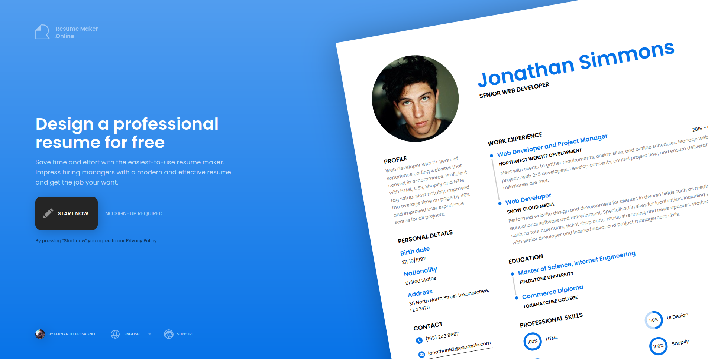
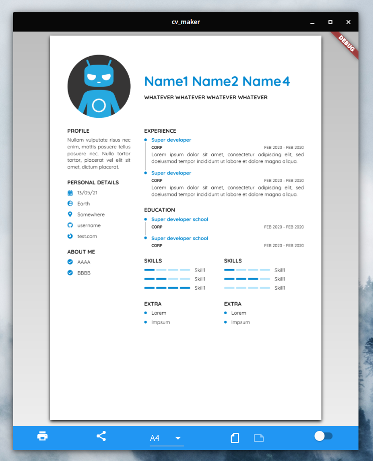
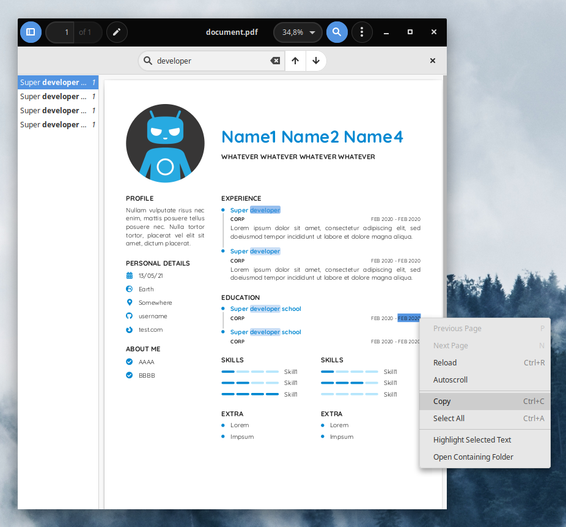
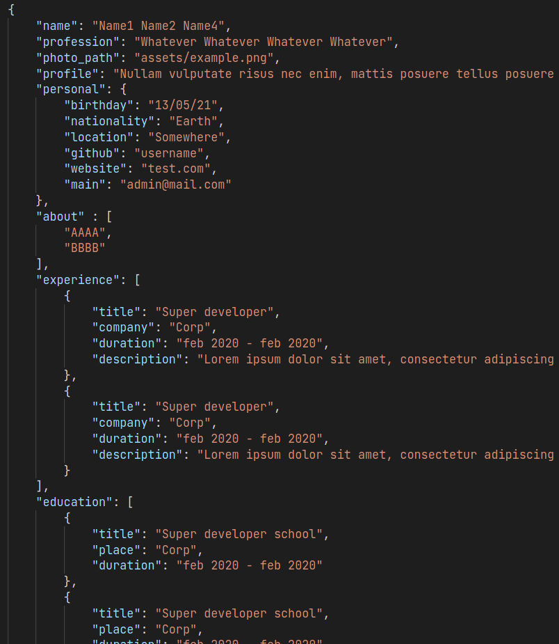

# CV Maker

This project was built to test the capabilites of Flutter for pdf rendering. Some designs are not easy to build on Word (or equivalents), while Flutter gives the user the power to create anything they can think of.

A quickly workaround used in some CV makers is to output the result as a image embedded in a PDF. Even though this technique unblocks any kind of layout, it makes the text unselectable and unsearchable.

## Case Study

One of these online websites using the screenshot technique is [resumemaker.online](https://www.resumemaker.online).

Its CV design looks really modern and clean, and the layout is complex enough to prove Flutter strenghts.

## Result

The result app could be considered a MVP at this point. The layout was built without any issue and it is fully extensible. In fact, I was able to some design tweaks really easily. 

In the picture above, you can see it running on Linux! Thanks to the native multiplatform support, it is automatically compatible with every available platform.

Moreover, the generated PDF allows to copy and search text, fulfilling all the features wanted.

Finally, right now the app is reading all the data from a JSON file in order to dynamically generate the final layout.

